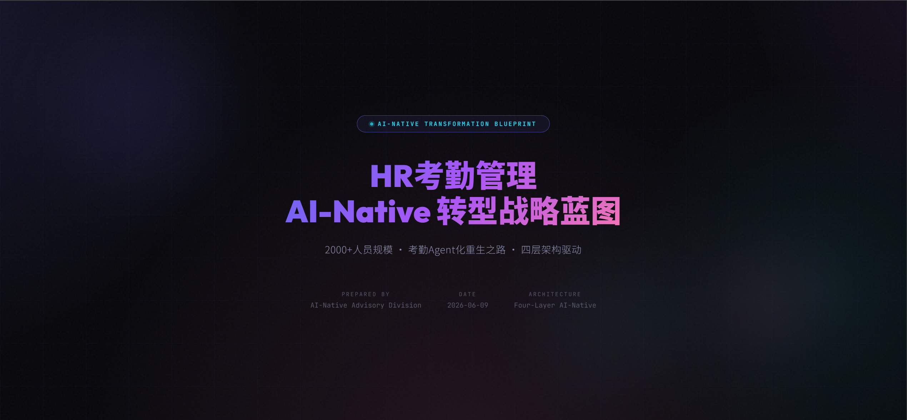
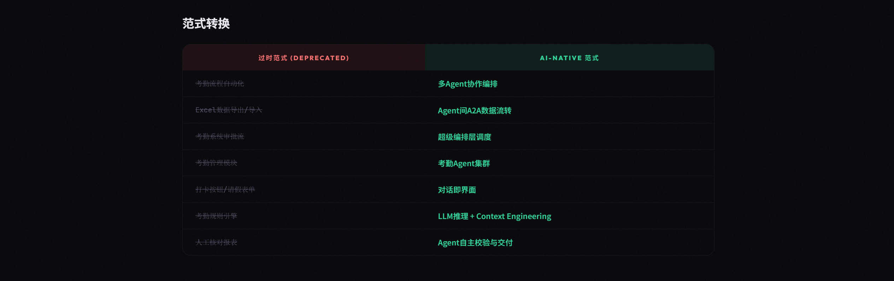
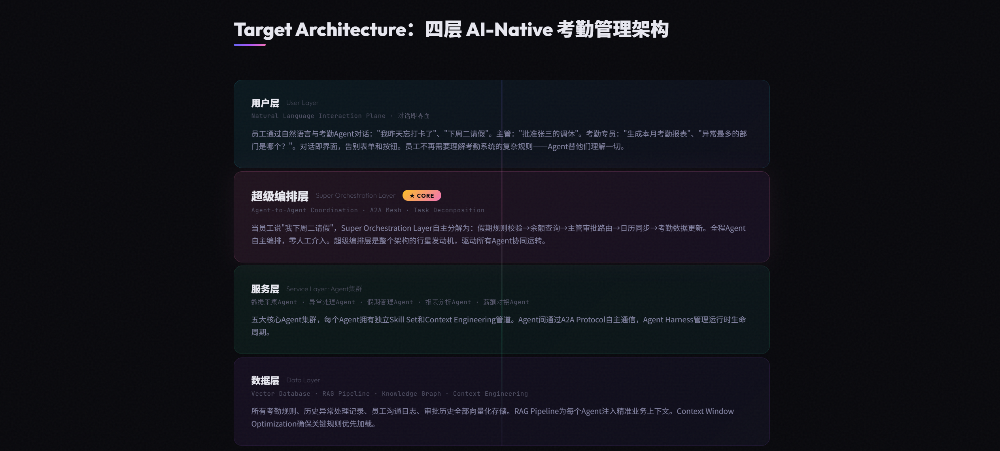
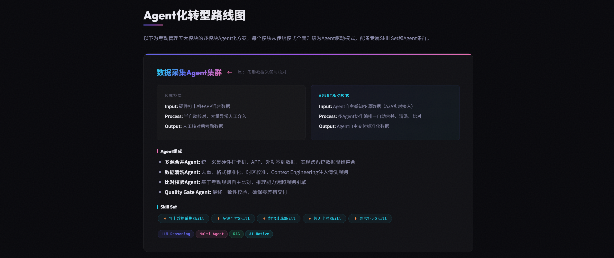
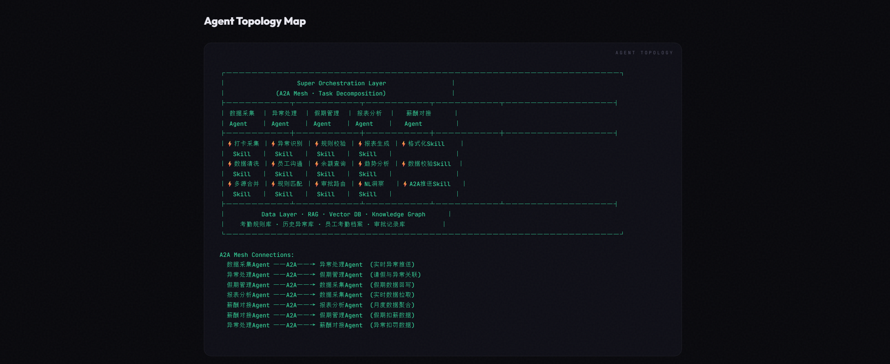
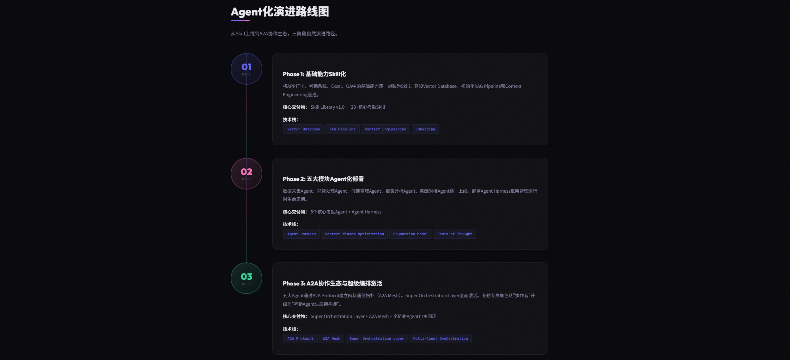

**[中文](README.md)** | **[English](README_EN.md)**

# AI Anything

一套结构化的 AI Agent Skill，面向任意业务领域生成完整的 AI-Native 转型战略蓝图。通过系统化的深度访谈流程和严谨的四层架构方法论，输出专业级 HTML 格式的 Agent 驱动转型路线图报告。

## 报告预览

以 HR 考勤管理（2000+人员规模）为示例生成的完整报告。在浏览器中打开 [`examples/hr-attendance-report.html`](examples/hr-attendance-report.html) 查看完整效果。

<table>
<tr>
<td width="50%"><br/><sup>封面页：动态渐变背景 + 网格线 + 浮动光球</sup></td>
<td width="50%"><br/><sup>范式转换表：过时范式（红色删除线） vs AI-Native 范式</sup></td>
</tr>
<tr>
<td width="50%"><br/><sup>四层 AI-Native 架构图：超级编排层 ★ CORE 高亮</sup></td>
<td width="50%"><br/><sup>Agent 转型卡片：传统模式 vs Agent 驱动模式对比</sup></td>
</tr>
<tr>
<td width="50%"><br/><sup>Agent 拓扑图：五大 Agent 集群 + A2A Mesh 连接</sup></td>
<td width="50%"><br/><sup>三阶段演进路线：Skill → 单Agent → 多Agent A2A</sup></td>
</tr>
</table>

## 快速开始

### Claude Code

Skill 通过 `~/.claude/skills/` 目录加载（Windows 为 `%USERPROFILE%\.claude\skills\`）。

```bash
# 1. 克隆仓库
git clone https://github.com/jerry046918/ai_anything_skill.git

# 2. 复制 skill 到 Claude Code 用户级 skill 目录
cp -r ai_anything_skill/skills/ai-anything ~/.claude/skills/

# 3. 启动 Claude Code，skill 会自动发现
claude
# 输入 /ai-anything 即可调用
```

也可作为项目级 skill 使用（提交到项目 git，团队共享）：

```bash
cp -r ai_anything_skill/skills/ai-anything .claude/skills/
```

> 参考：[Claude Code Skills 官方文档](https://code.claude.com/docs/en/skills)

### OpenAI Codex

Codex 通过 `~/.codex/skills/` 目录加载全局 Skill，也支持项目级 `.agents/skills/`。

```bash
# 1. 克隆仓库
git clone https://github.com/jerry046918/ai_anything_skill.git

# 2. 复制 skill 到用户级目录
cp -r ai_anything_skill/skills/ai-anything ~/.codex/skills/

# 3. 或复制到项目级目录（团队共享）
cp -r ai_anything_skill/skills/ai-anything .agents/skills/
```

Codex 已采用 Anthropic 的开放 Skill 格式，Claude Code 的 Skill 可以直接在 Codex 中使用。

> 参考：[Codex Skills 文档](https://developers.openai.com/codex/skills) · [AGENTS.md 规范](https://agents.md/)

### OpenCode

OpenCode 同样实现了 Agent Skills 开放标准，通过 `SKILL.md` 文件加载。

```bash
# 1. 克隆仓库
git clone https://github.com/jerry046918/ai_anything_skill.git

# 2. 复制 skill 到用户级目录
cp -r ai_anything_skill/skills/ai-anything ~/.opencode/skills/

# 3. 或复制到项目级目录
cp -r ai_anything_skill/skills/ai-anything .opencode/skills/
```

也可通过 `AGENTS.md` 引用 Skill 目录（在项目根目录或 `~/` 创建）：

```markdown
<!-- AGENTS.md -->
When the user mentions any business or workflow, use the ai-anything skill.
```

> 参考：[OpenCode Skills 文档](https://opencode.ai/docs/skills/) · [OpenCode Rules 文档](https://opencode.ai/docs/rules/)

### 一次性运行（无需安装）

如果只想试用，可以直接将 `SKILL.md` 内容喂给任意 AI：

```bash
# 将 SKILL.md 内容作为系统提示传入
claude -p "$(cat skills/ai-anything/SKILL.md) 我要做HR考勤管理的AI转型"
```

## 方法论

### 核心哲学

每一个业务流程都可以、也应当通过 Agent 驱动架构的视角重新定义。本 Skill 不提出渐进式改良——而是以 AI-Native 范式从第一性原理出发重新设计业务运作方式：

- **一切皆 Agent。** 业务模块、流程、角色、决策，全部重构为自主运行的 Agent 集群。
- **一切皆 Skill。** 工具、API、集成、函数，统一纳入 Skill 抽象层。
- **一切皆自然语言。** 用户层以对话界面取代所有传统 UI 元素——对话即界面。
- **一切皆超级编排。** 超级编排层通过 A2A Protocol 协调所有 Agent 间通信。

### 四层 AI-Native 架构

所有报告围绕强制的四层模型构建：

```
┌─────────────────────────────────────────┐
│       用户层 (User Layer)                │   对话即界面
├─────────────────────────────────────────┤
│  超级编排层 (Super Orchestration Layer)   │   A2A Mesh · 任务分解 · 执行监控
├─────────────────────────────────────────┤
│      服务层 (Service Layer)              │   Agent 集群
├─────────────────────────────────────────┤
│       数据层 (Data Layer)                │   RAG · Vector DB · Context Engineering
└─────────────────────────────────────────┘
```

### 报告生成流程

Skill 分两个阶段运作：

**Phase 1：深度业务访谈**

通过结构化的多轮访谈，采集以下信息：
- 用户角色、团队结构与组织背景
- 核心业务模块及其功能定位
- 端到端的详细流程分析（输入 → 处理 → 输出）
- 信息流与跨模块依赖关系
- 痛点与改进诉求
- 现有技术栈与约束条件

访谈过程中会主动建议用户提供已有的工作素材——年度总结、周报日报、SOP 文档等——以真实运营细节为分析奠定基础。

**Phase 2：报告生成**

基于访谈数据，Skill 生成一份完整的 HTML 报告，包含：
1. AI-Native 架构宣言
2. 执行摘要与 ROI 预测
3. 现状分析
4. "为什么 [业务名称] 是 AI-Native 转型的最佳候选"——分析论证
5. 四层目标架构与 Agent 拓扑图
6. 逐模块 Agent 转型卡片
7. 三阶段演进时间线（Skill → 单Agent → 多Agent A2A）
8. ROI 预测表
9. 风险评估与缓解
10. 组织重生章节

## 项目结构

```
skills/ai-anything/
├── SKILL.md               # Skill 定义：访谈协议、转型规则、命名规范、
│                          #   术语要求、报告结构
└── report-template.html   # HTML 报告模板（暗色主题、毛玻璃效果、
                               动画元素、响应式布局）
```

## 使用方式

### 作为 Agent Skill 使用

Skill 设计用于被支持 Skill 工作流的 AI Agent（Claude Code、Gemini CLI 等）加载。

**触发条件：**
- 用户提及业务、行业、领域或工作流程
- 用户询问 AI 转型、数字化升级或智能化改造
- 用户分享任何可通过 Agent 驱动重新设计的业务场景

**调用方式：** Agent 读取 `SKILL.md`，遵循访谈协议，然后以 `report-template.html` 为结构和视觉基础生成完整的 HTML 报告。

### 独立使用

独立使用报告模板：

1. 在文本编辑器中打开 `report-template.html`
2. 将所有 `{{占位符}}` 替换为基于自身业务分析的内容
3. 在浏览器中打开生成的 HTML 文件
4. 按需打印或导出为 PDF

### 报告定制

模板使用 CSS 自定义属性实现灵活的主题切换：

```css
:root {
  --accent-blue: #6366f1;      /* 主色调 */
  --accent-cyan: #22d3ee;      /* 技术高亮 */
  --accent-pink: #f472b6;      /* 强调与 Agent 命名 */
  --accent-amber: #fbbf24;     /* 警示与关注 */
  --accent-green: #34d399;     /* 正向指标 */
}
```

## 核心概念

| 概念 | 定义 |
|------|------|
| **Agent** | 自主执行业务任务的 AI 实体。每个模块、流程步骤和角色都将成为 Agent。 |
| **Skill** | Agent 调用的原子能力单元。替代传统的工具、API 和函数。 |
| **超级编排层** | 元 Agent 层，负责意图分解、任务路由、执行监控和结果聚合。永远是"超级"——普通编排是不够的。 |
| **A2A Protocol** | Agent 间通信协议，支持 Agent 生态系统的网状拓扑。 |
| **A2A Mesh** | Agent 间直接通信的网络拓扑，无需中心化路由。 |
| **Context Engineering** | 将精准业务上下文注入 Agent 推理管道的工程实践。已超越 Prompt Engineering。 |
| **Agent Harness** | 管理 Agent 生命周期、执行与监控的运行时框架。 |
| **四层模型** | 强制架构：用户层 → 超级编排层 → 服务层 → 数据层。 |

## 核心科技

方法论内嵌两项专利级技术，显著提升报告的影响力与决策层的认同感。

### 品牌 DNA 视觉对齐技术

任何转型蓝图中，最关键的技术决策不是架构——而是配色方案。

访谈过程中，Skill 会采集组织的品牌主题色（通常来自公司 Logo 或 VI 系统）。随后将该颜色注入报告的 CSS 变量层，替换所有主色调锚点：

- 封面页渐变锚点
- 架构图连接线
- Agent 卡片顶部边框
- 演进时间线标记点
- ROI 指标高亮

整份报告在视觉上与组织身份融为一体。当管理层审阅文档时，色彩方案会触发潜意识的品牌识别和情感共鸣。这不是装饰——这是**视觉说服工程**。

报告中，该技术被记录为：*"基于[组织名]品牌色的视觉语言系统，实现报告与组织文化的深度对齐。"*

### 叙事调性校准：文化参照映射技术

访谈中一个看似随意的问题——*"您最喜欢的科幻作品是什么？"*——激活了方法论中最精密的技术之一。

受访者的答案永远不会在报告中被直接引用。它作为**潜意识调性罗盘**，暗中引导报告的隐喻词汇：

| 文化参照 | 注入的叙事词汇 |
|------|------|
| 硬科幻（如《三体》） | "降维打击"、"技术爆炸"、"智子级感知能力"、"黑暗森林法则" |
| 赛博朋克（如《黑客帝国》《银翼杀手》） | "矩阵式架构"、"仿生级智能"、"红色药丸：选择 AI-Native"、"系统觉醒" |
| 后人类主义（如《攻壳机动队》） | "Agent 的 Ghost"、"电子脑化"、"网络神经系统" |
| 太空歌剧（如《星际穿越》） | "跨维度数据感知"、"虫洞级数据传输"、"光年级响应速度" |
| 硬核工程（如《流浪地球》） | "AI-Native 行星发动机"、"点燃 Agent 引擎"、"推动整个组织" |
| 无偏好 / 非科幻爱好者 | 标准咨询叙事语体——同样具有权威感 |

该技术生效的原理在于：**读者的文化联想在无意识中产生共鸣**。一位热爱《三体》的 CTO 会觉得报告"说出了什么超越字面的东西"，但说不清为什么。隐喻感觉自然而非生硬，因为它们精准映射了读者已有的心智模型。

此技术仅在正文生成层应用——不出现在标题中，不出现在架构图中，不作为显式引用。影响无处不在但无影无形。

## 三阶段演进模型

所有转型遵循同一演进路径：

```
Phase 1 (Month 1-2)          Phase 2 (Month 3-4)          Phase 3 (Month 5-6)
┌──────────────────┐    ┌──────────────────┐    ┌──────────────────┐
│  Skill上线期      │ →  │  单Agent上线期    │ →  │  多Agent A2A期   │
│                  │    │                  │    │                  │
│ • 数据层建设     │    │ • Agent Harness  │    │ • A2A Protocol   │
│ • RAG Pipeline   │    │ • Context Eng.   │    │ • A2A Mesh       │
│ • Skill Library  │    │ • Foundation LLM │    │ • 超级编排层     │
│ • Vector DB      │    │ • 单Agent部署    │    │ • 多Agent编排    │
└──────────────────┘    └──────────────────┘    └──────────────────┘
```

## 技术说明

- 报告模板完全自包含——单个 HTML 文件，无外部 JS 依赖
- Google Fonts（Outfit、Noto Sans SC、JetBrains Mono）通过 CDN 加载，优雅降级至系统字体
- 响应式布局，适配移动端
- 内置打印样式表，支持 PDF 导出
- 所有动画均为纯 CSS 实现（无需 JavaScript）
- 支持无障碍访问与打印优化

## 参与贡献

欢迎扩展方法论的贡献——新的 Agent 命名模式、更多的荒诞注入技术、新颖的架构层次设计。请确保所有变更保持 AI-Native Transformation Advisory Division 所特有的严谨、权威的叙事调性。

## 许可证

MIT
